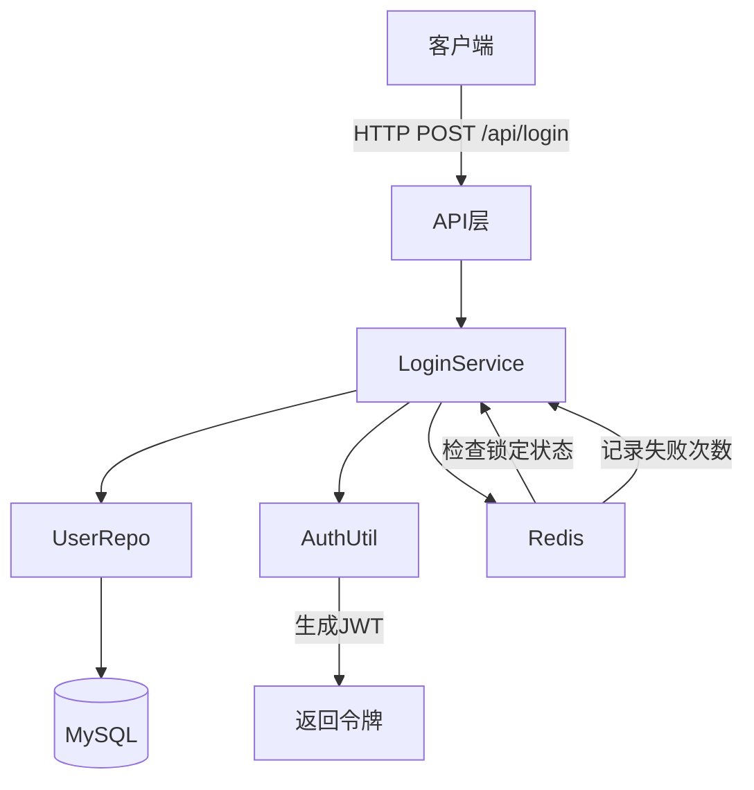

# 用户登录功能 - 技术设计文档

> 文档路径：.specs/user-login-20241106001/design.md
> 创建时间：2024-11-06
> 需求来源：【用户登录功能实现】文字需求描述
> 关联wiki：doc/iwiki.md

## 概述

### 需求说明

**需求标题**：用户登录功能实现
**需求来源**：文字需求 - 实现基于用户名/密码的登录功能，支持JWT令牌认证
**需求描述**：为系统添加用户登录功能，包括：
1. 用户名和密码验证
2. JWT令牌生成和验证
3. 登录状态管理
4. 登录失败次数限制

**验收标准**：
- [ ] 用户可以使用正确的用户名密码登录
- [ ] 登录成功后返回JWT令牌
- [ ] 错误的用户名或密码返回明确的错误提示
- [ ] 连续5次登录失败后锁定账户15分钟
- [ ] JWT令牌有效期为24小时
- [ ] 所有敏感信息（密码）必须加密存储

### 迭代目标

实现安全可靠的用户登录认证体系，为后续功能提供身份验证基础。

### 项目现状分析

**基于项目 wiki 文档**：`doc/iwiki.md`

- **现有实现**：
  - 技术栈：tRPC-Go + MySQL 8.0 + Redis
  - ORM：GORM
  - 项目结构：api/service/repo/model/middleware/config/utils
  
- **待优化点**：
  - 缺少用户认证体系
  - 缺少JWT令牌管理
  - 缺少登录安全防护机制
  
- **影响范围**：
  - 新增：用户认证模块
  - 新增：JWT中间件
  - 影响：后续所有需要认证的接口

## 歧义与待确认清单

### 需求理解疑问

- [x] **疑问 1**：是否支持第三方登录（如微信、企业微信）？
  - 当前理解：本期只实现用户名密码登录
  - 待确认：是否需要预留第三方登录扩展接口
  - 影响范围：接口设计、数据表结构
  - **已确认**：本期只实现用户名密码登录，预留扩展接口

- [x] **疑问 2**：密码强度要求是什么？
  - 当前理解：最少8位，包含字母和数字
  - 待确认：是否需要特殊字符要求
  - 影响范围：前端验证、后端校验逻辑
  - **已确认**：最少8位，包含字母和数字即可

- [x] **疑问 3**：是否需要验证码？
  - 当前理解：本期不实现验证码功能
  - 待确认：是否需要在登录失败多次后要求验证码
  - 影响范围：安全策略、用户体验
  - **已确认**：本期不实现，后续可添加

### 技术方案待定项

- [x] **待定 1**：JWT密钥如何管理？
  - 方案 A：硬编码在配置文件（不安全）
  - 方案 B：使用环境变量配置，定期轮换（推荐）
  - 推荐方案：方案B，通过环境变量注入，每月轮换一次
  - 待确认：密钥轮换周期是否合理
  - **已确认**：使用环境变量配置，定期轮换

- [x] **待定 2**：账户锁定信息存储在哪里？
  - 方案 A：存储在MySQL（持久化，但增加数据库压力）
  - 方案 B：存储在Redis（高性能，自动过期）
  - 推荐方案：方案B，使用Redis存储，15分钟自动过期
  - 待确认：是否需要持久化锁定记录
  - **已确认**：使用Redis存储，自动过期

- [x] **待定 3**：密码加密算法？
  - 方案 A：MD5（不安全，已淘汰）
  - 方案 B：bcrypt（安全，行业标准）
  - 推荐方案：方案B，使用bcrypt，cost=10
  - 待确认：cost参数是否需要调整
  - **已确认**：使用bcrypt，cost=10

### 边界条件确认

- [x] **边界 1**：并发登录是否允许？
  - 场景描述：同一账号在多个设备/浏览器同时登录
  - 当前假设：允许并发登录，但记录所有活跃令牌
  - 待确认：是否需要实现单点登录（踢出其他设备）
  - **已确认**：允许并发登录，记录所有活跃令牌

- [x] **边界 2**：令牌刷新机制？
  - 场景描述：JWT令牌过期后如何处理
  - 当前假设：本期不实现刷新机制，令牌过期需重新登录
  - 待确认：是否需要实现refresh_token机制
  - **已确认**：本期不实现，令牌过期需重新登录

> **说明**：所有待确认项已经过确认，可以进入任务规划阶段。

## 架构设计

### 整体架构



### 改动说明

本次需求新增用户认证模块，包括登录接口、JWT中间件和安全防护机制。

## 改动分析

### 新增模块

- **模块名称**：用户认证模块
  - 功能职责：处理用户登录、JWT生成验证、登录安全防护
  - 技术选型：tRPC-Go + JWT + bcrypt
  - 关键组件：
    - `api/login_api.go` - 登录接口处理
    - `service/login_service.go` - 登录业务逻辑
    - `repo/user_repo.go` - 用户数据访问
    - `utils/jwt_util.go` - JWT工具函数
    - `utils/password_util.go` - 密码加密工具
    - `middleware/auth_middleware.go` - JWT认证中间件

### 修改模块

- **模块名称**：配置管理模块
  - 修改原因：需要添加JWT相关配置
  - 修改内容：在 `config/config.go` 中添加JWT密钥、过期时间等配置项
  - 影响范围：需要更新配置文件模板和环境变量说明

### 删除模块

无

## 依赖服务调用

### 无依赖服务调用

本次需求为独立后端逻辑，不涉及外部依赖服务调用。

内部依赖：
- **Redis**：存储登录失败次数和账户锁定信息
  - Key格式：`login:failed:{username}` - 失败次数
  - Key格式：`login:locked:{username}` - 锁定状态
  - TTL：900秒（15分钟）

## 接口与数据

### 新增接口

#### 接口 1：用户登录

- **路径**：`POST /api/v1/login`
- **方法**：POST
- **请求参数**：
  ```json
  {
    "username": "string",  // 用户名，必填，2-50字符
    "password": "string"   // 密码，必填，8-100字符
  }
  ```
- **响应格式（成功）**：
  ```json
  {
    "code": 0,
    "message": "登录成功",
    "data": {
      "token": "eyJhbGciOiJIUzI1NiIsInR5cCI6IkpXVCJ9...",
      "expires_at": 1699257600,
      "user_info": {
        "user_id": 123,
        "username": "testuser"
      }
    }
  }
  ```
- **响应格式（失败）**：
  ```json
  {
    "code": 40001,
    "message": "用户名或密码错误",
    "data": null
  }
  ```
- **错误码**：
  - `40001` - 用户名或密码错误
  - `40002` - 账户已被锁定
  - `40003` - 参数验证失败
- **功能说明**：验证用户名和密码，生成JWT令牌，实现登录失败次数限制

### 修改接口

无

### 数据模型

#### 模型 1：User（用户表）

```sql
CREATE TABLE users (
  id BIGINT PRIMARY KEY AUTO_INCREMENT,
  username VARCHAR(50) UNIQUE NOT NULL,
  password_hash VARCHAR(255) NOT NULL,
  created_at TIMESTAMP DEFAULT CURRENT_TIMESTAMP,
  updated_at TIMESTAMP DEFAULT CURRENT_TIMESTAMP ON UPDATE CURRENT_TIMESTAMP,
  INDEX idx_username (username)
);
```

**字段说明**：
- `id`：用户唯一标识符
- `username`：用户名（2-50字符，唯一）
- `password_hash`：密码哈希值（bcrypt加密）
- `created_at`：创建时间
- `updated_at`：更新时间

#### 模型 2：JWT Payload

```json
{
  "user_id": 123,
  "username": "testuser",
  "exp": 1699257600,
  "iat": 1699171200
}
```

**字段说明**：
- `user_id`：用户ID
- `username`：用户名
- `exp`：过期时间（Unix时间戳）
- `iat`：签发时间（Unix时间戳）

## 技术难点与对策

### 难点 1：密码安全存储

- **问题描述**：密码明文存储风险高，容易被攻击者获取
- **技术挑战**：需要选择合适的加密算法，平衡安全性和性能
- **解决方案**：
  - 使用bcrypt加密算法，cost=10
  - 密码自动加盐处理
  - 示例代码：
    ```go
    import "golang.org/x/crypto/bcrypt"
    
    func HashPassword(password string) (string, error) {
        hash, err := bcrypt.GenerateFromPassword([]byte(password), 10)
        return string(hash), err
    }
    
    func VerifyPassword(hashedPassword, password string) bool {
        err := bcrypt.CompareHashAndPassword([]byte(hashedPassword), []byte(password))
        return err == nil
    }
    ```
- **备选方案**：如果性能不满足，可以考虑使用scrypt或argon2

### 难点 2：登录失败次数限制

- **问题描述**：如何高效统计和管理登录失败次数，防止暴力破解
- **技术挑战**：需要支持高并发，且能自动过期清理
- **解决方案**：
  - 使用Redis的INCR原子操作
  - 设置15分钟过期时间
  - 示例逻辑：
    ```go
    key := fmt.Sprintf("login:failed:%s", username)
    count, _ := redis.Incr(key).Result()
    if count == 1 {
        redis.Expire(key, 15*time.Minute)
    }
    if count >= 5 {
        redis.Set(fmt.Sprintf("login:locked:%s", username), "1", 15*time.Minute)
        return errors.New("账户已锁定")
    }
    ```
- **备选方案**：如果Redis不可用，降级为仅记录日志，不限制登录

### 难点 3：JWT密钥管理

- **问题描述**：JWT密钥泄露会导致令牌可被伪造
- **技术挑战**：如何安全存储和轮换密钥
- **解决方案**：
  - 密钥存储在环境变量中，不提交到代码仓库
  - 不同环境使用不同密钥
  - 定期轮换密钥（建议每月）
  - 密钥轮换时支持双密钥验证（旧密钥和新密钥都能验证）
- **备选方案**：使用KMS（密钥管理服务）存储密钥

## 测试策略

### 单元测试

- **覆盖率要求**：≥80%
- **测试重点**：
  - 密码加密和验证逻辑（`password_util`）
  - JWT生成和验证逻辑（`jwt_util`）
  - 登录业务逻辑（`login_service`）
  - 失败次数统计和账户锁定逻辑
  - 边界条件处理（空值、特殊字符等）
- **测试框架**：Go testing + testify

**关键测试用例**：
1. `TestHashPassword` - 密码加密
2. `TestVerifyPassword` - 密码验证
3. `TestGenerateJWT` - JWT生成
4. `TestValidateJWT` - JWT验证
5. `TestLoginService_Success` - 登录成功
6. `TestLoginService_WrongPassword` - 密码错误
7. `TestLoginService_AccountLocked` - 账户锁定

### 集成测试

- **测试场景**：
  - 正常登录流程（端到端）
  - 错误密码5次后锁定
  - 锁定后15分钟自动解锁
  - JWT令牌有效性验证
  - 并发登录测试（100并发）
  - Redis不可用时的降级测试

### 回归测试

- **测试范围**：
  - 无影响现有功能，无需回归测试
- **测试方法**：自动化

## 风险与应急预案

### 风险 1：Redis故障导致无法记录失败次数

- **风险等级**：中
- **影响范围**：登录安全防护功能失效
- **应急预案**：
  - 降级方案：跳过失败次数检查，记录日志
  - 告警通知：立即通知运维团队
  - 恢复措施：修复Redis服务后自动恢复
- **监控指标**：Redis连接失败率

### 风险 2：JWT密钥泄露

- **风险等级**：高
- **影响范围**：令牌可被伪造，系统安全性受损
- **应急预案**：
  - 立即轮换密钥
  - 强制所有用户重新登录
  - 排查泄露源头
  - 通知安全团队
- **监控指标**：异常令牌生成告警

### 风险 3：数据库查询性能问题

- **风险等级**：低
- **影响范围**：登录响应变慢
- **应急预案**：
  - username字段已建索引，单表查询性能可控
  - 如性能不足，添加读写分离
  - 考虑使用缓存优化
- **监控指标**：数据库查询耗时（目标：<50ms）

### 灰度方案

- **灰度策略**：
  1. 第一阶段（10%用户）：内部测试用户
  2. 第二阶段（50%用户）：按用户ID取模
  3. 第三阶段（100%用户）：全量发布
- **观察指标**：
  - 登录成功率（目标：>95%）
  - 登录接口响应时间（目标：P99 < 200ms）
  - 失败登录次数告警（阈值：单用户5次/15分钟）
  - JWT验证失败率（目标：<1%）
- **灰度周期**：每个阶段持续1天

### 回滚方案

- **回滚触发条件**：
  - 登录成功率 < 90%
  - P99响应时间 > 500ms
  - 出现严重安全漏洞
- **回滚步骤**：
  1. 执行回滚脚本
  2. 恢复旧版本代码
  3. 清理新版本数据（如有）
  4. 验证回滚成功
- **数据处理**：新增用户数据保留，仅回滚代码逻辑

## 附录

### 参考文档

- [bcrypt算法文档](https://pkg.go.dev/golang.org/x/crypto/bcrypt)
- [JWT标准规范](https://jwt.io)
- [tRPC-Go框架文档](https://trpc.group/trpc-go)

### 变更记录

| 日期 | 版本 | 修改内容 | 修改人 |
|------|------|---------|--------|
| 2024-11-06 | 1.0 | 初始版本 | 开发团队 |
