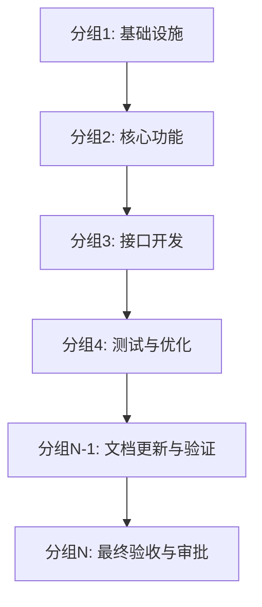

# 阶段2：任务规划

## 阶段目标

✅ 基于设计方案拆解任务  
✅ 合理分组（每组3-5个任务）  
✅ 明确依赖关系和执行顺序  
✅ 通过计划文档验证  
✅ 获得用户审批通过  

## 强制执行清单

下列 4 个步骤 ✅ **全部完成**后，才能进入阶段 3。

### Step 0：验证前置条件 ⭐

**强制检查点**：
```bash
cd <项目根目录> && python3 <SKILL_DIR>/scripts/phase_gateway.py --check-phase 2
```

**检查内容**：阶段1完成状态、设计方案审批、design.md 存在

**⚠️ 必须通过**（exit code = 0）才能进入阶段2

📖 **详细说明**：[验证操作手册 - 前置条件检查](../scripts-reference.md#5-phase_gatewaypy---check-phase-n---前置条件检查)

---

### Step 1：生成任务规划

**输出要求**：
- 基于模板：`tasks.md.template`
- 输入内容：`design.md`
- 输出路径：`.specs/{feature_name}-{requirement_id}/tasks.md`

**⚠️ 严格遵循 design.md 规范**：
1. **任务拆解**：必须严格按照 design.md 的技术方案和架构设计
2. **接口设计**：必须与 design.md 的接口定义完全一致
3. **技术覆盖**：必须覆盖 design.md 中的所有技术难点和风险预案
4. **任务顺序**：必须符合 design.md 的依赖关系
5. **验收清单**：必须包含 design.md 中的所有验收标准

**必需内容**：

#### 1. 任务列表

每个任务包含：
```markdown
### T1: {任务名称}

**描述**: 详细任务说明
**设计参考**: design.md 中的对应章节
**文件操作**: 新建/修改的文件列表
**预计用时**: 10-15 分钟
**状态**: todo/doing/done
**所属分组**: 分组1
```

**任务粒度要求**：
- 每个任务 10-15 分钟可完成
- 任务描述清晰具体
- 可独立验证完成

#### 2. 任务分组

**📋 分组数量与原则**：

| 需求复杂度 | 推荐分组数 | 说明 |
|------------|------------|------|
| 简单需求 | 4-5个分组 | 功能单一，改动范围小（含2个强制分组） |
| 中等需求 | 5-6个分组 | 功能中等，涉及多个模块（含2个强制分组） |
| 复杂需求 | 6-8个分组 | 功能复杂，改动范围大（含2个强制分组） |

**⚠️ 注意事项**：
- 倒数第二个分组必须是"文档更新与验证"（强制分组 N-1）
- 最后一个分组必须是"最终验收与审批"（强制分组 N，使用 spec-workflow skill）
- 包含2个强制分组后，总分组数建议不超过8个
- 分组 N-1 包含2个任务：T{N-1}（更新wiki）、T{N}（验证wiki）
- 分组 N 包含4个任务：T{N+1}（验证任务完成）、T{N+2}（质量检查）、T{N+3}（生成总结）、T{N+4}（人工审批）
- 任务编号延续前面分组，如前面最后是T9，则分组N-1为T10、T11，分组N为T12、T13、T14、T15

**分组原则**：
- 每组3-5个任务（约30-60分钟）
- 按依赖关系分组
- 关键路径优先
- 独立可验证

#### 3. 依赖关系图



#### 4. 分组执行计划

```markdown
## 分组执行计划

### 分组1：基础设施（预计60分钟）
- T1: 数据库表结构设计
- T2: 数据模型定义
- T3: 配置文件更新

### 分组2：核心功能（预计45分钟）
- T4: 业务逻辑实现
- T5: 数据访问层
...

### 分组N-1：文档更新与验证（预计30分钟）⭐
- T{N-1}: 更新项目wiki文档
- T{N}: 验证wiki文档完整性（使用 spec-workflow skill）

### 分组N：最终验收与审批（预计35分钟）⭐
- T{N+1}: 验证任务完成状态（使用 spec-workflow skill）
- T{N+2}: 最终质量检查（使用 spec-workflow skill）
- T{N+3}: 生成执行总结文档（使用 spec-workflow skill）
- T{N+4}: 等待人工审批（使用 spec-workflow skill）
```

#### 5. 验收清单

```markdown
## 验收清单

### 功能验收
- [ ] 需求验收标准1
- [ ] 需求验收标准2

### 技术验收
- [ ] 单元测试覆盖率 ≥80%
- [ ] 回归测试通过
- [ ] 代码审查通过

### 文档验收
- [ ] 接口文档更新
- [ ] Wiki 文档更新（通过分组N-1的T{N-1}任务）
- [ ] Wiki 文档验证（通过分组N-1的T{N}任务，使用 spec-workflow skill）

### 流程验收（使用 spec-workflow skill）
- [ ] 任务完成状态验证（通过分组N的T{N+1}任务）
- [ ] 最终质量检查通过（通过分组N的T{N+2}任务）
- [ ] 执行总结文档生成（通过分组N的T{N+3}任务）
- [ ] 人工审批通过（通过分组N的T{N+4}任务）
```

**⚠️ 强制约束**：必须基于模板生成，否则验证脚本会拒绝

**验证依据**：
- `validate_tasks.py` 会检查模板中的所有必需内容
- 模板定义的结构（任务列表、分组、依赖图、验收清单）= 验证脚本的检查项
- 分组超过7个、缺少依赖关系图、任务缺少必需字段都会导致验证失败

📋 **模板参考**：
- [任务规划模板](../../assets/templates/tasks.md.template)
- [完整案例](../../examples/user-login-20241106001/tasks.md)

---

### Step 2：验证任务规划 ⭐

**强制验证**：
```bash
cd <项目根目录> && python3 <SKILL_DIR>/scripts/validate_tasks.py .specs/{feature_name}-{requirement_id}/tasks.md
```

**验证通过**（exit code = 0）后进入 Step 3

📖 **详细说明**：[验证操作手册 - validate_tasks.py](../scripts-reference.md#3-validate_taskspy---任务规划验证)
  - 确认分组数量是否需要调整
  - 确认依赖关系是否准确
  - 手动修改tasks.md后告知AI
- 用户确认后可继续重试

**验证失败示例**：
```bash
$ cd <项目根目录> && python3 <SKILL_DIR>/scripts/validate_tasks.py tasks.md
❌ 发现以下错误（必须修复）：
  1. 任务分组超过7个（当前9个）
  2. 分组3缺少依赖关系说明
  3. 任务T5缺少预计用时字段

💡 修复建议：
  1. 合并相关分组，控制在6个以内
  2. 在"分组执行顺序"章节中补充清晰的依赖说明
  3. 为所有任务添加预计用时（10-15分钟）

# 修复后重新验证
$ cd <项目根目录> && python3 <SKILL_DIR>/scripts/validate_tasks.py tasks.md
✅ 所有检查通过！
```

---

### Step 3：等待人工审批 ⭐

**⚠️ 审批约束**：必须使用有效审批用语（详见 [审批操作手册](../approval-guide.md)）

**✅ 有效**：`审批通过` `确认无误` `同意` `批准` `可以` `没问题`  
**❌ 无效**：`继续` `好的` `下一步` `开始` `OK` `行`

**执行要点**：
1. 验证通过后 → ⏸️ 停止并展示审批提示
2. 等待用户输入 → 🔍 检查是否含有效用语
3. 有效 → 执行审批命令 | 无效 → 重新提示（不得重试）

**审批提示要求**：
展示审批提示，包含：
- 文档路径（`.specs/{feature_name}-{requirement_id}/tasks.md`）
- 审阅要点（任务拆分合理性、依赖关系清晰性、预计用时准确性）
- 有效审批用语说明（审批通过/确认无误/同意/批准/可以/没问题）
- 无效用语提醒（继续/好的/下一步/开始/OK/行）

**审批命令**：
```bash
cd <项目根目录> && python3 <SKILL_DIR>/scripts/phase_gateway.py --approve-phase 2 --approval "<当前对话用户回复的审批原文>" --approver "<当前对话的用户名称>"
```

**详细流程与约束**：[审批操作手册 - 标准流程](../approval-guide.md#审批执行流程标准话术)
---

## 如需修改本阶段

### 阶段回退机制

如果阶段2完成后，发现任务规划需要调整：

**直接修改文档**：
```bash
# 1. 直接编辑任务规划文档
vim .specs/{feature_name}-{requirement_id}/tasks.md

# 2. 重新验证
cd <项目根目录> && python3 <SKILL_DIR>/scripts/validate_tasks.py .specs/{feature_name}-{requirement_id}/tasks.md

# 3. 重新请求审批（使用用户当前对话回复的原文）
cd <项目根目录> && python3 <SKILL_DIR>/scripts/phase_gateway.py --approve-phase 2 --approval "<当前对话用户回复的审批原文>" --approver "<当前对话的用户名称>"
```

**⚠️ 注意事项**：
- 已完成的代码不会被删除（需手动调整）
- 任务分组调整后，建议重新执行阶段3

**使用场景**：
- 任务分组不合理，执行中发现依赖关系错误
- 需要新增或删除任务
- 任务粒度过大或过小需要调整
- 发现遗漏了关键任务

---

## 完成标志

✅ **全部通过后**：
- 自动显示工作流进度可视化
- 准备进入阶段 3（计划执行）

---

## 相关文档

- [阶段3: 计划执行](phase-3-execution.md) - 下一阶段
- [设计方案参考](phase-1-design.md)
